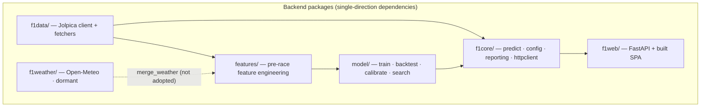
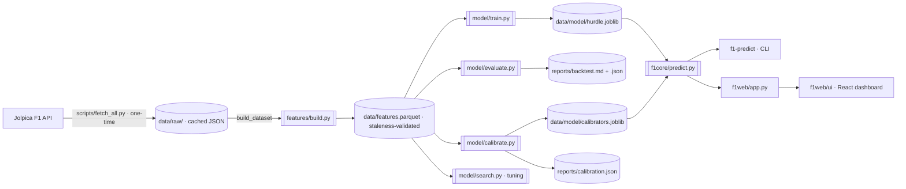
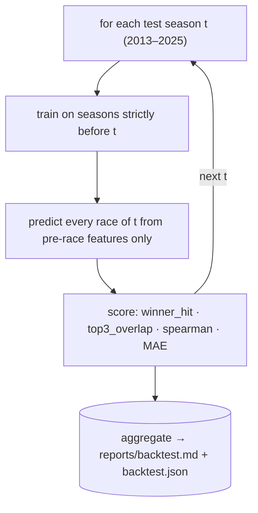
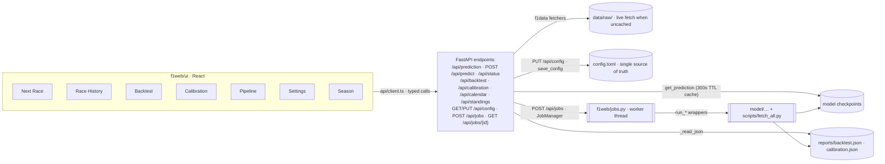

# F1 Result Predictor — Overview

> **For a new reader:** this document is the map. It explains what the repository
> is, how the packages fit together, where every artifact lives, how to extend
> the code, and what was deliberately kept (or removed) after the dead-code
> audit. The [README](README.md) covers setup, usage, and results.

**What this is:** a local tool that predicts **points per driver** for a
Formula 1 race from *strictly pre-race* information (grid, qualifying, driver
and team form, circuit history, championship position), using a zero-inflated
hurdle model trained on 2010–2025 race data from the
[Jolpica F1 API](https://www.jolpi.ca/ergast/) (the Ergast successor):

```
E[points] = P(top-10) × E(points | top-10)
```

with companion classifiers for P(top-3) and P(win). Output is the full grid
ranked by expected points (quantized to the points table). Python ≥ 3.12,
managed with [uv](https://docs.astral.sh/uv/); CLI + FastAPI + React dashboard;
Dockerized.

---

## Repository map

| Path | Role | Key entry points |
| --- | --- | --- |
| `f1data/` | Polite, cached Jolpica API client + normalized fetchers | `F1Client` (`client.py`), `fetch_season`, `fetch_calendar`, `fetch_*` (`fetchers.py`) |
| `f1weather/` | Open-Meteo weather layer — **evaluated, not adopted** (kept deliberately) | `WeatherClient`, `load_race_weather`, `weather_frame` |
| `features/` | Feature engineering: per-start dataset with strictly pre-race features + points target, plus the declarative feature registry | `build_dataset`, `add_features`, `assemble` (`build.py`); `REGISTRY`, `enabled_features`, `feature_fingerprint` (`registry.py`) |
| `model/` | Hurdle model (HGB classifier + regressor), walk-forward backtest, isotonic calibration, hyperparameter search | `train_final_model`, `run_backtest`, `fit_calibrators`, `search` |
| `f1core/` | Shared core: prediction pipeline, config loader **+ writer**, markdown/ranking helpers, HTTP base class | `predict_race`, `get_prediction` (`predict.py`), `load_config`/`save_config`/`validate_config` (`config.py`), `to_md`/`rank_by` (`reporting.py`) |
| `f1web/` | FastAPI JSON API + host for the built React SPA, plus an in-process async job runner for pipeline steps | `create_app` (`app.py`), `JobManager` + `run_*` handlers (`jobs.py`), `f1web/ui/` (React + Vite + TS) |
| `scripts/` | One-off fetch / tooling scripts | `fetch_all.py` (data), `fetch_weather.py` (weather), `download_fixtures.py` (test fixtures) |
| `tests/` | Fully offline test suite (recorded fixtures) incl. full-pipeline e2e | `test_e2e.py`, `test_features.py`, `helpers.py`, `fixtures/` |
| `data/` | Regenerable caches (gitignored): raw API JSON, dataset, model checkpoints | `raw/`, `features.parquet`, `model/`, `weather/` |
| `reports/` | Generated snapshots (refresh with the CLI: `f1-backtest`, `f1-calibrate`) | `backtest.md`/`.json`, `prediction.md`, `calibration.json` (written on demand), `weather.md` |
| `config.toml` | Runtime config — the **single source of truth** (built-in defaults in `f1core/config.py` match it). The dashboard writes it back in place (`PUT /api/config`) | — |
| `Dockerfile`, `docker-compose.yml` | Self-contained dashboard image (builds SPA, bakes data, named `reports` volume) | — |
| `.github/workflows/ci.yml` | CI: pytest matrix (3.12/3.13) + ruff/pyright lint job | — |
| `pyproject.toml` | Packaging, console scripts, ruff/pytest config | console scripts: `f1-predict`, `f1-train`, `f1-backtest`, `f1-calibrate`, `f1-search`, `f1-web` |

## System architecture



Every package imports shared helpers (`f1core`) from a single installable
package — no `sys.path` hacks. `f1weather` is the only layer not in the
adopted path; its plumbing stays by decision (see [Deliberate keeps](#deliberate-keeps)).

## Data & artifact pipeline



Everything after the one-time fetch runs **offline**: raw responses are cached
under `data/raw/`, the dataset cache rebuilds only when its schema/version
changes, and model checkpoints carry feature-set fingerprints.

## Walk-forward backtest



This is the honest-evaluation backbone: the model is never tested on seasons it
trained on, and the same walk-forward output feeds the calibration
out-of-sample scores.

## Web / API flow



**Control surface.** The dashboard drives the whole pipeline: **Settings**
edits `config.toml` (including the HGB hyperparameters under `[model.params]`
and the feature selection) and writes it back in place; **Pipeline** runs
fetch / train / calibrate / backtest / search as async background jobs (one at
a time via a worker thread, the rest queued) with live logs and inline results,
and can apply a search's best config. `POST /api/predict` applies *ephemeral*
overrides (season/round, grid CSV, feature toggles) in memory only. The CLI
reads the exact same `config.toml`, so neither surface drifts. Jobs are tied to
the server process lifetime; `reports/jobs/*.json` records a durable history.

## Key invariants (don't break these)

- **Strictly pre-race data.** Every rolling/cumulative feature uses `shift(1)`;
  teammate gaps are computed within a race and rolled over *prior* races only;
  walk-forward trains on strictly earlier seasons. Enforced by unit tests
  (`test_no_leakage_rolling_features_use_prior_races_only`,
  `test_no_leakage_future_changes_do_not_affect_features`,
  `test_weather_is_strictly_pre_race_no_forward_leak`).
- **Offline after fetch.** Raw JSON → parquet dataset → joblib checkpoints;
  each layer is a cache with staleness/version validation.
- **Uniform error shape.** The API returns `{"error": ...}` for every failure,
  incl. 422 validation and a path-traversal guard on `/assets`.
- **Shared discipline.** `CachedHTTPClient` (polite UA, rate limit, retry,
  on-disk cache) is the base of both `F1Client` and `WeatherClient`; ranking
  and markdown rendering are shared (`f1core/reporting.py`).
- **Calibrators deploy only when they help.** Isotonic calibration is applied
  per-target only where it improves hold-out Brier; currently none is deployed
  and the mechanism stays in place.

## Extending this repo

| You want to… | Go here |
| --- | --- |
| Add a pre-race feature | `features/build.py` → `add_features` + a `_add_*` helper; register in `NUMERIC_FEATURES`/`CATEGORICAL_FEATURES` **and** in `features/registry.py` (id, category, default, builder, rationale); test in `tests/test_features.py` + `tests/test_registry.py`; bump the dataset cache version in `build_dataset` if the schema changes |
| Toggle features / audit the set | `config.toml` `[features] enabled`, CLI `--enable-features`/`--disable-features`, or `scripts/feature_audit.py` (`reports/features.md`) |
| Try a model change | `model/train.py` (`HurdleModels`), tune via `model/search.py`, measure via `f1-backtest`; re-run `f1-calibrate` after retraining |
| Add an API endpoint | route in `f1web/app.py` + typed function in `f1web/ui/src/api/client.ts` + component; errors must be `{"error": ...}` |
| Add a config field | `f1core/config.py`: add to `DEFAULTS`, a `SCHEMA` field descriptor, and a check in `validate_config`; the Settings form and the TOML writer pick it up automatically |
| Add a pipeline step (job) | add a `run_* -> dict` wrapper in the relevant module (each CLI `main()` delegates to it), register a handler + payload keys in `f1web/jobs.py`, and surface it on the Pipeline page |
| Add a dashboard tab | new component under `f1web/ui/src/components/<tab>/`, wire in `App.tsx`; reuse `useApi`/`useJob` and `lib/format` |
| Re-run the weather experiment | `reports/weather.md` has the full recipe and the gate result |
| Add a CLI | function `main() -> int` + entry in `pyproject.toml` `[project.scripts]` |
| Change the data source / season range | `config.toml` (`[api]`, `[data]`) — defaults live in `f1core/config.py` |
| Add tests | offline fixtures via `tests/fixtures/` + `scripts/download_fixtures.py`; full-chain behavior goes in `tests/test_e2e.py` |

## Audit appendix (dead-code round)

Scope agreed with the maintainer: **remove dead code only** — no renames,
moves, or refactors; the weather layer stays.

- **Removed.** `coverage_report` (`features/build.py`) — a per-season coverage
  utility with zero consumers outside its own re-export (`features/__init__.py`)
  and its dedicated test. Deleted from `features/build.py`, `features/__init__.py`,
  and `tests/test_features.py`.
- **Examined and kept.** `f1web/ui/src/components/ui/DataState.tsx`
  (`ErrorState`/`Skeleton`/`ProgressState` — imported by all five tabs; an
  initial "dead" claim was a grep artifact), the `f1weather` layer (user
  decision; README + `reports/weather.md` document the rejected experiment),
  `model/search.py` (live `f1-search` dev tool), `scripts/download_fixtures.py`
  (regenerates the tracked test fixtures), and every fetcher/helper/fixture.
- **Convoluted but deliberately unchanged** (documented for a future round):
  - `f1core/predict.py` is a ~23 KB monolith mixing prediction, report
    formatting (`format_report`), and the CLI (`main`) — a candidate for
    splitting `format_report` into `f1core/reporting.py` and the CLI into its
    own module.
  - `CachedHTTPClient` (base class in `f1core/httpclient.py`) has exactly one
    subclass in the adopted path (`F1Client`); if `f1weather` is ever removed,
    the base/derived split could fold into `f1data/client.py`.
  - `config.toml` mirrors `f1core/config.py` `DEFAULTS` by design, so every
    CLI works without a config file.
- **Local-only artifacts** (`build/`, `*.egg-info`, `pyright_errors.json`,
  `ruff_errors.txt`) are gitignored outputs, not repo content.

## Open questions / next steps

- **Headline edge is thin.** The model beats grid order on winner hit-rate
  (0.550 vs 0.535) and Spearman (0.656 vs 0.623) but grid still wins
  top-3 overlap (0.686) and MAE (2.83). The feature audit (2026-08,
  `reports/features.md`) cut 17 low-impact/redundant features (off by
  default; winner_hit 0.539 → 0.550, everything else within noise). What
  feature could actually move top-3/MAE — per-circuit setup, strategy data,
  2026-regs data?
- **2026 regulation change** is an imminent transfer-risk event for a model
  trained on 2010–2025 (the `points_era` split only covers pre/post-2019).
- **Weather re-evaluation** plumbing is ready (`f1weather/`); the first attempt
  failed 1-of-3 metrics, all within noise — finer granularity is the obvious
  retry.
- **No UI test suite** exists (only an `oxlint` config) — vitest coverage of
  `f1web/ui` is the largest test gap.
- **Consider serving distributions** of race outcomes rather than point
  estimates as a differentiator over the grid baseline.
