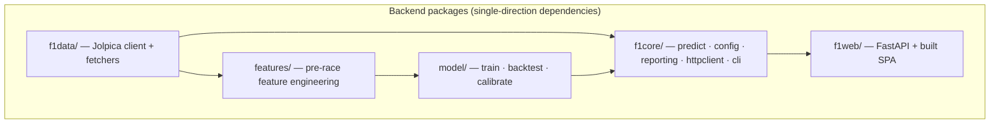
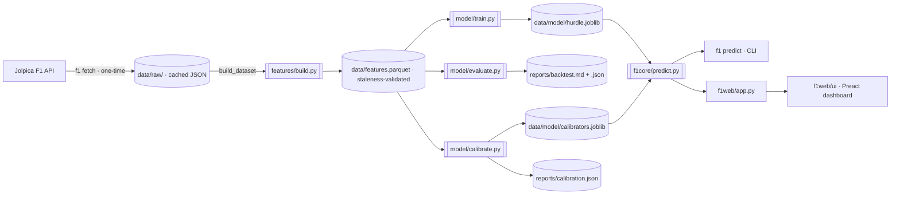
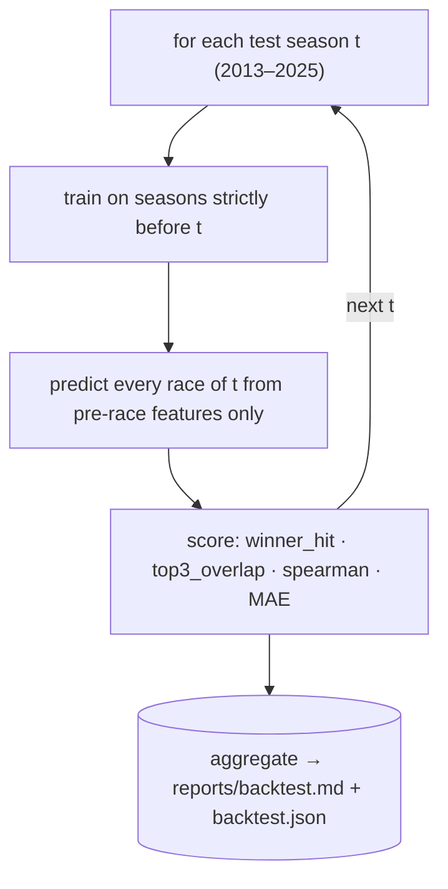
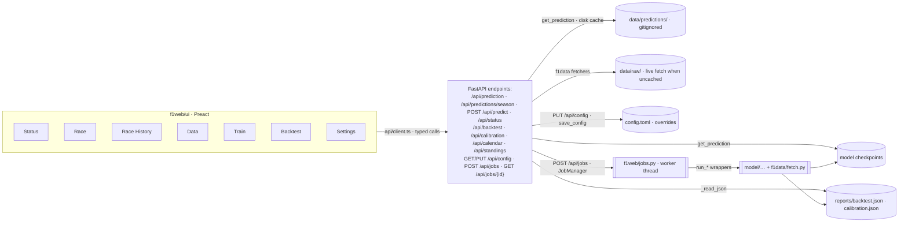

# F1 Result Predictor

Predicts **points per driver** for a Formula 1 race from *pre-race* information
(grid, qualifying, driver/team form, circuit history, championship position),
using a zero-inflated hurdle model trained on 2010–2026 race data from the
[Jolpica F1 API](https://www.jolpi.ca/ergast/) (the Ergast successor).

```
E[points] = P(top-10) × E(points | top-10)
```

with companion classifiers for P(top-3) and P(win). The output is the full
grid ranked by expected points (quantized to the points table). Python ≥ 3.12,
managed with [uv](https://docs.astral.sh/uv/); CLI + FastAPI + React dashboard;
Dockerized.

> 📖 **New to the repo?** The [Repository map](#repository-map) section below is
> the map: what each package does, where every artifact lives, and the
> [invariants](#key-invariants-dont-break-these) that keep the model honest.

## Setup

```bash
uv sync --all-extras     # install project + test/lint/web deps into .venv (Python 3.12)
f1 fetch                         # fetch + cache the configured season range (one-time)
uv run pytest -q                 # run the test suite
```

Requires Python ≥ 3.12 and [uv](https://docs.astral.sh/uv/) (``uv sync`` pins
the environment to ``uv.lock``). The raw API responses are cached under
`data/raw/` (one-time ~2 min fetch; everything after that runs offline). The
install registers a single console script, `f1` (subcommands below) — activate
the venv (`.venv\Scripts\activate` on Windows, `source .venv/bin/activate`
elsewhere) so it is on your PATH.

## Usage

Everything runs through one `f1` command with subcommands, each delegating to
the same keyword-only `run_*` wrapper the web dashboard uses (so the CLI and
the UI never drift). Config/report paths are relative to the working
directory, so run from the repo root (or pass absolute `--out`/`--dataset`
paths).

| Command | What it does |
| --- | --- |
| `f1 fetch [--start 2010] [--end 2026]` | fetch and cache raw API data |
| `f1 train` | train the final model → `data/model/hurdle.joblib` |
| `f1 calibrate` | fit isotonic probability calibrators → `data/model/calibrators.joblib` (run after every `f1 train`) |
| `f1 backtest [--no-quantize]` | walk-forward backtest vs baselines → `reports/backtest.md` + `.json` (quantized by default) |
| `f1 predict` | predict the **next race** → `reports/prediction.md` |
| `f1 predict --season 2024 --round 22` | predict any race; past races are verified vs actuals |
| `f1 predict --grid qual.csv` | supply a qualifying grid (`driver_id,grid`) for an upcoming race |
| `f1 web [--host 127.0.0.1] [--port 8080]` | local web API + dashboard (needs the `web` extra) |
| `docker compose up --build` | build + start the dashboard in a container |

Every command has an equivalent `uv run python <module>.py ...` form from the
repo root; the `f1` subcommands are the documented path.

Examples:

```bash
f1 predict                                          # Dutch GP 2026 (next race)
f1 predict --season 2024 --round 22                 # dry run: Las Vegas 2024 + verification
f1 predict --grid qual.csv                          # with known grid for the next race
```

## Web UI

Quickest path — no venv or Node toolchain needed, fully offline:

```bash
docker compose up --build      # build the image, start on http://127.0.0.1:8080/
```

The image is self-contained: it builds the React dashboard (`f1web/ui`),
installs the app, and bakes in the cached raw data, the dataset and the model
checkpoints (`data/`), so everything runs offline. Generated snapshots
(`reports/backtest.json`, `reports/calibration.json`) live in a named `reports`
volume and survive rebuilds; the baked-in data is refreshed only by rebuilding
the image (e.g. after `f1 fetch` or `f1 train`):

```bash
docker compose exec web f1 backtest          # refresh /api/backtest
docker compose exec web f1 calibrate         # refresh /api/calibration
```

Without Docker (requires the `web` extra):

```bash
uv sync --extra web          # or uv sync --all-extras
f1 web --port 8080            # open http://127.0.0.1:8080/
```

Endpoints: `/` and `/dashboard` (React dashboard), `/health`, and the JSON API
under `/api/*` (GET `/api/prediction`, GET `/api/predictions/season`,
`/api/backtest`, `/api/calibration`, `/api/calendar`, `/api/standings`,
`/api/status`, GET/PUT `/api/config`, `POST /api/jobs`, `GET /api/jobs`,
`GET /api/jobs/{id}`, `POST /api/jobs/{id}/cancel`, `POST /api/predict`). The
dashboard is the single
frontend — there is no server-rendered HTML (the FastAPI backend only serves
JSON + the built SPA). Predictions are computed on demand through the same
code path as the CLI and cached on disk under `data/predictions/` (gitignored),
so repeat calls and whole-season fetches are instant. It is a local tool, not a
service.

### Full pipeline control from the dashboard

The dashboard is a deliberately small control surface for the core loop:
**fetch data → train → backtest**, plus race views. The **Status** tab is a
three-step readiness checklist (fetch / train / backtest) with one-click runs
for missing steps; **Data** fetches raw Jolpica data; **Train** builds the
dataset, trains the hurdle model, and calibrates its probabilities in one job;
**Backtest** scores models against the grid / championship / zero baselines;
**Race** shows a single race's prediction with a season selector and prev/next
navigation; **Race History** loads a whole season in one request (with a
**Precompute race history** job that warms whole-season caches under
`data/predictions`, keyed by season + feature fingerprint + params, so repeat
opens are instant); the **Settings** tab edits every `config.toml` value
(including the HGB hyperparameters under `[model.params]` and the feature
selection) and writes them back in place.

**Race** is the full per-race control surface (it posts to `POST /api/predict`,
so every CLI predict override is available): a **model picker** (`--model`,
defaults to the deployed checkpoint; named models keep their own calibrators),
an interactive **qualifying-grid editor** for upcoming races (`--grid` —
per-driver grid inputs seeded from the model's grid, with a reset button and
invalid-input highlighting), a **Write report** checkbox (the same
`reports/prediction.md` the CLI `--out` produces), and the existing
"Re-fetch from API" refresh toggle. Feature overrides are NOT offered here —
any changed features require a model retrained with them (Train tab). Edits
stay local until **Apply changes**;
override predictions are cached on disk per model + grid, so repeats are
instant and different models/grids never share a cached payload.

Every tab is **deep-linkable** via a URL hash (`#/race`, `#/backtest`, …) —
refresh, the browser back button, and shared links restore the tab. Race
History rows link straight into the Race tab for that round, the Race pager
names the GP and offers a **Next race** quick-jump, and the header carries the
global orientation: a **running-job pill** (`Running: <job> · <elapsed>`) and a
**Pipeline not ready → Open Status** alert whenever the readiness check fails.
Settings uses human-friendly labels with a sticky save bar and an
**unsaved-changes guard** (leaving the tab with pending edits asks first). The
Backtest mean table comes with a plain-language metric glossary and all charts
carry screen-reader labels.

Pipeline steps run as async background jobs (one at a time, the rest queued)
with live logs and results rendered inline. Every result-affecting option of
the core steps is available from the tabs: season range (`--start/--end` — the
pickers are clamped to the modern era, 2014+, up to the latest season with
fetched data; the Data tab's end ceiling is the configured `[data] end_season`
so new seasons can still be fetched), the backtest quantize toggle
(`--no-quantize`), and two cache overrides: **Data**'s "Re-fetch from API
(ignore cache)" re-downloads raw Jolpica responses, and **Race History**'s
"Recompute all races (ignore prediction cache)" clears the prediction
snapshots. Train and Backtest need no such toggle: the featured dataset
rebuilds automatically whenever the raw cache is newer than the parquet (see
[Data & artifact pipeline](#data--artifact-pipeline)). Train accepts a
**model name** —
blank overwrites the configured checkpoint, a name saves a separate
`data/model/<name>.joblib` recorded in `data/model/index.json` (with its
feature list, fingerprint, params and training season range) — and then fits
the calibrators: a named model is calibrated on its own out-of-sample seasons
(written to `data/model/<name>.calibrators.joblib`), while the config-default
model uses the shared `[model] calibrators` file fitted on walk-forward
out-of-sample scores. If the model was trained through the newest season and
no out-of-sample seasons remain, calibration is skipped with a note in the job
log — predictions then stay on raw probabilities.

**Backtest** is model-centric: pick any number of saved models (or the config
default) and the job scores each with the features it was trained on; walk-
forward retraining is an advanced option. The tab shows a saved-models
overview (training window, rows, features, params), the classic model-vs-
baselines tables and per-season trend charts, and — when two or more models
were scored — a **model comparison**: per-metric line charts with one series
per model plus the baselines, and a delta table against the deployed model
(positive = better, MAE reversed). Path overrides (`--cache-dir`, `--dataset`,
`--out`, `--out-json`) stay config-managed: edit them in the Settings tab and
web jobs honour the configured paths.

Calibration lives in a **panel at the bottom of Backtest** (no separate tab):
run `f1 calibrate`'s equivalent as a job — model choice (the config default or
a saved model, which is calibrated on its own out-of-sample seasons), season
range, and advanced fit-through/eval-from windows — and review the
`reports/calibration.json` report: per-target raw vs calibrated Brier with the
deployment decision, plus reliability curves (predicted vs observed with the
perfect-calibration diagonal). The view refreshes automatically when a
calibration job finishes. `POST /api/predict` accepts *ephemeral* overrides
(season/round, a grid CSV, model checkpoint, feature toggles, refresh, and
optionally writing the same `reports/prediction.md` the CLI produces) that are
merged over the config in memory only — nothing is written to `config.toml`.

> ⚠️ **Docker persistence:** `docker-compose.yml` bind-mounts `./config.toml`
> into the container and keeps `data/` (fetched raw data, dataset, models,
> prediction cache) and `reports/` on named volumes, so dashboard edits and
> pipeline artifacts survive image rebuilds — the CLI and web always
> read/write the same file, so either surface works. Jobs are tied to the
> server process lifetime: `uvicorn --reload` restarts kill in-flight jobs;
> the `reports/jobs/*.json` history is reloaded at startup (jobs left
> queued/running by the dead process are marked **interrupted**). A **queued**
> job can be cancelled from the Jobs widget — running jobs stay atomic and
> cannot be torn down mid-run.

### Accessing the dashboard

Open the dashboard in a normal browser at a **concrete** address:

- **This machine:** `http://127.0.0.1:8080/` (or `http://localhost:8080/`)

> ⚠️ **Do not use `http://0.0.0.0:8080/`.** `0.0.0.0` is the "bind to all

## Configuration

`config.toml` (optional — a minimal overrides-only file by default): the
built-in defaults live in `f1core/config.py` `DEFAULTS` and every CLI/pipeline
step resolves its paths, season range, API sleep, and HGB hyperparameters from
them; `config.toml` overrides any of: API base URL / User-Agent, cache paths,
season range, model checkpoint, report paths, the feature selection
(`[features] enabled`), and `[model.params]`. CLI flags override config
values. The dashboard's Settings tab writes the full effective config back in
place (`PUT /api/config` + `save_config`) so the CLI and web always read the
same settings; per-race prediction overrides are ephemeral (in-memory only).

## Repository map

| Path | Role | Key entry points |
| --- | --- | --- |
| `f1data/` | Polite, cached Jolpica API client + normalized fetchers | `F1Client` (`client.py`), `fetch_season`, `fetch_calendar`, `fetch_*` (`fetchers.py`) |
| `features/` | Feature engineering: per-start dataset with strictly pre-race features + points target, plus the declarative feature registry | `build_dataset`, `add_features`, `assemble` (`build.py`); `REGISTRY`, `enabled_features`, `feature_fingerprint` (`registry.py`) |
| `model/` | Hurdle model (HGB classifier + regressor), walk-forward backtest, isotonic calibration | `train_final_model`, `run_backtest`, `fit_calibrators` |
| `f1core/` | Shared core: prediction pipeline, config loader **+ writer**, markdown/ranking helpers, HTTP base class, and the `f1` CLI | `predict_race`, `get_prediction` (`predict.py`), `load_config`/`save_config`/`validate_config` (`config.py`), `to_md`/`rank_by` (`reporting.py`), `main` + subcommand handlers (`cli.py`) |
| `f1web/` | FastAPI JSON API + host for the built React SPA, plus an in-process async job runner for pipeline steps | `create_app` (`app.py`), `JobManager` + `run_*` handlers (`jobs.py`), `f1web/ui/` (Preact + Vite + TS) |
| `scripts/` | One-off tooling | `download_fixtures.py` (regenerates the tracked test fixtures) |
| `tests/` | Fully offline test suite (recorded fixtures) incl. full-pipeline e2e | `test_e2e.py`, `test_features.py`, `helpers.py`, `fixtures/` |
| `data/` | Regenerable caches (gitignored): raw API JSON, dataset, model checkpoints, prediction cache | `raw/`, `features.parquet`, `model/`, `predictions/` |
| `reports/` | Generated snapshots (refresh with the CLI: `f1 backtest`, `f1 calibrate`, `f1 predict`) | `backtest.md`/`.json`, `prediction.md`, `calibration.json` (written on demand) |
| `config.toml` | Runtime config **overrides** — the built-in defaults in `f1core/config.py` (`DEFAULTS`) are the baseline; the dashboard writes the full effective config back in place (`PUT /api/config`) | — |
| `Dockerfile`, `docker-compose.yml` | Self-contained dashboard image (builds SPA, bakes data, named `reports` volume) | — |
| `.github/workflows/ci.yml` | CI: pytest matrix (3.12/3.13) + ruff lint job | — |
| `pyproject.toml` | Packaging, console scripts, ruff/pytest config | console script: `f1 = f1core.cli:main` |

## System architecture

```
f1 fetch             ->  data/raw/*.json            (cached API responses)
f1data/                     polite cached client + normalized fetchers
f1core/                     shared core: predict, config, reporting, httpclient, cli
features/build.py           per-start dataset: strictly pre-race features,
                            points target, leakage-tested
features/registry.py        declarative feature registry (id, category,
                            default, builder, rationale) + selection helpers
model/train.py              hurdle model (HGB classifier + regressor)
model/calibrate.py          isotonic probability calibration (per-target)
model/evaluate.py           walk-forward backtest vs grid/championship/zero
f1web/app.py                FastAPI JSON API + built-SPA host
```



Every package imports shared helpers (`f1core`) from a single installable
package — no `sys.path` hacks.

## Data & artifact pipeline



Everything after the one-time fetch runs **offline**: raw responses are cached
under `data/raw/`, and model checkpoints carry feature-set fingerprints. The
dataset cache (`data/features.parquet`) rebuilds automatically when its schema
changes **or when the raw cache is newer** (file mtimes) — so after a re-fetch,
`f1 train` / `f1 backtest` pick up the new data with no extra flags.

## Walk-forward backtest



This is the honest-evaluation backbone: the model is never tested on seasons it
trained on, and the same walk-forward output feeds the calibration
out-of-sample scores.

## Web / API flow



**Control surface.** The dashboard drives the core loop — **Data** (fetch),
**Train** (train + calibrate in one job), **Backtest** — as async background
jobs (one at a time via a worker thread, the rest queued) with live logs and
inline results; the **Status** tab is the readiness checklist with one-click
runs. **Settings** edits `config.toml` (including the HGB hyperparameters under
`[model.params]` and the feature selection) and writes it back in place.
Backtest selects any number of saved models (each scored with its own
features) and charts their differences — per-metric model-vs-model lines plus
a delta table against the deployed model. The **Race** tab navigates a single
race (season selector + prev/next), and **Race History** loads a whole season
through `/api/predictions/season` in one dataset pass. `POST /api/predict`
applies *ephemeral* overrides (season/round, grid CSV, model checkpoint) in
memory only. Repeat predictions hit the disk-backed cache
under `data/predictions/` (gitignored, keyed by season/round/feature-fingerprint/
params). The CLI reads the exact same `config.toml`, so neither surface drifts.
Jobs are tied to the server process lifetime; `reports/jobs/*.json` records a
durable history.

## Feature registry & selection

All 31 features (27 numeric + 4 categorical) are registered in
`features/registry.py` — the single source of truth for id, category, default,
builder, and rationale — and classified by a walk-forward permutation-importance
audit with drop-column ablation:

| category | meaning | default |
| --- | --- | --- |
| `core` | high impact (survived FDR q=0.05 in ≥1 hurdle component) | on |
| `selectable` | low impact; kept for experiments | off |
| `cut` | removal improved the backtest ≥1 SE (ablation gate) | off |

The default enabled set is the 14 core features (registry defaults; override
via `[features] enabled` in `config.toml`). Every feature is still computed;
only the enabled subset enters the
training matrix. Toggle per run with `--enable-features`/`--disable-features`
on `f1 train`, `f1 backtest`, `f1 predict`, `f1 calibrate`;
toggling changes the model-checkpoint fingerprint, so stale checkpoints are
rejected instead of silently reused.

## Probability calibration

The gradient-boosted classifiers' raw probabilities can be overconfident (a
common trait of gradient boosting). `model/calibrate.py` collects genuinely
out-of-sample raw scores and fits isotonic
calibrators for P(top-10) / P(top-3) / P(win). Two modes: the classic
walk-forward mode (OOS scores from the backtest's per-season retrains) and a
**model-centric mode** used for named models — pass `model_path` and the
checkpoint's own feature set is used, its out-of-sample scores are the seasons
*after* its training window, and the deployment decision is evaluated on the
**newest** such season only (fit on every earlier one). Calibrators are written
next to the model (`data/model/<name>.calibrators.joblib`) and prediction picks
up the sibling file automatically. A calibrator is **deployed only
where it improves Brier on a chronological hold-out** (fit on OOS seasons
2013–2020, evaluated on 2021–2025). With the current tuned model the raw
probabilities are already well-calibrated, so no calibrator is deployed
(calibration would hurt all three targets); the mechanism stays in place and
re-activates automatically if a future model is miscalibrated again. The
dashboard's Train job runs calibration automatically (the config-default model
gets the shared walk-forward calibrators, a named model gets its own); run
`f1 calibrate` after every CLI `f1 train`. `f1core/predict.py` applies the
saved calibrators automatically.

## Results (honest)

Walk-forward backtest, train on all seasons strictly before the test season,
evaluate 2013–2025 (mean per race). Model = hurdle on the 14 **core**
registry features (see [Feature registry & selection](#feature-registry--selection)),
tuned hyperparameters, and expected points **quantized to
the points table** (adopted because it improved walk-forward
MAE/top-3/Spearman):

| baseline | winner_hit | top3_overlap | spearman | MAE (pts) |
| --- | --- | --- | --- | --- |
| **model** | **0.550** | 0.659 | **0.656** | 2.92 |
| grid order | 0.535 | **0.686** | 0.623 | **2.83** |
| championship | 0.450 | 0.613 | 0.617 | 3.99 |
| zero | 0.535 | 0.686 | 0.623 | 4.99 |

The model **beats the grid-order baseline on winner hit-rate** (0.550 vs
0.535) and on ranking correlation (Spearman 0.656 vs 0.623). Grid order still
edges it on top-3 (0.659 vs 0.686) and MAE (2.92 vs 2.83 — the grid baseline
predicts the exact points-table value whenever the pole sitter wins, which no
probabilistic model can match). The feature audit cut 17 low-impact/redundant
features (kept off by default): winner_hit rose from 0.539 to 0.550 with no
metric moving beyond the fold-to-fold noise floor.

Dry run (Las Vegas 2024, predicted from pre-race info only): winner hit ✓,
top-3 overlap 0.67, Spearman 0.79, MAE 1.95 points.

## Limitations

- Win/podium probabilities are isotonic-calibrated where that improved
  hold-out Brier (top-3 and win); P(top-10) is raw. The **ranking** remains
  the primary output.
- Without qualifying results (`--grid`) the prediction for an upcoming race is
  weaker — grid is the single strongest feature.
- Drivers with no history (rookies, new teams) get missing-feature handling
  (gradient boosting supports missing values natively).
- Sprint points are features, not part of the main-race points target.

## API terms

The Jolpica API asks clients to send a descriptive `User-Agent` (configured in
`config.toml`) and to cache responses — both are handled by `F1Client`
(polite rate limiting, retry/backoff, on-disk cache).

## Key invariants (don't break these)

- **Strictly pre-race data.** Every rolling/cumulative feature uses `shift(1)`;
  teammate gaps are computed within a race and rolled over *prior* races only;
  walk-forward trains on strictly earlier seasons. Enforced by unit tests
  (`test_no_leakage_rolling_features_use_prior_races_only`,
  `test_no_leakage_future_changes_do_not_affect_features`).
- **Offline after fetch.** Raw JSON → parquet dataset → joblib checkpoints;
  each layer is a cache with staleness/version validation.
- **Uniform error shape.** The API returns `{"error": ...}` for every failure,
  incl. 422 validation and a path-traversal guard on `/assets`.
- **Shared discipline.** `CachedHTTPClient` (polite UA, rate limit, retry,
  on-disk cache) is the base of `F1Client`; ranking and markdown rendering
  are shared (`f1core/reporting.py`).
- **CLI ⇄ web parity.** Every pipeline step exposes a keyword-only
  `run_* -> dict` wrapper; both the `f1` subcommands and the web job runner
  call those, never a divergent path.
- **Calibrators deploy only when they help.** Isotonic calibration is applied
  per-target only where it improves hold-out Brier; currently none is deployed
  and the mechanism stays in place.

## Extending this repo

| You want to… | Go here |
| --- | --- |
| Add a pre-race feature | `features/build.py` → `add_features` + a `_add_*` helper; register in `NUMERIC_FEATURES`/`CATEGORICAL_FEATURES` **and** in `features/registry.py` (id, category, default, builder, rationale); test in `tests/test_features.py` + `tests/test_registry.py`; bump the dataset cache version in `build_dataset` if the schema changes |
| Toggle features / audit the set | `config.toml` `[features] enabled`, CLI `--enable-features`/`--disable-features` |
| Try a model change | `model/train.py` (`HurdleModels`), measure via `f1 backtest`; re-run `f1 calibrate` after retraining |
| Add an API endpoint | route in `f1web/app.py` + typed function in `f1web/ui/src/api/client.ts` + component; errors must be `{"error": ...}` |
| Add a config field | `f1core/config.py`: add to `DEFAULTS`, a `SCHEMA` field descriptor, and a check in `validate_config`; the Settings form and the TOML writer pick it up automatically |
| Add a pipeline step (job) | add a `run_* -> dict` wrapper in the relevant module (each `f1` subcommand delegates to it), register a handler + payload keys in `f1web/jobs.py`, and surface it on its dedicated tab (via the shared `JobRunner`) |
| Add a dashboard tab | new component under `f1web/ui/src/components/<tab>/`, wire in `App.tsx`; reuse `useApi`/`useJob` and `lib/format` |
| Add a CLI subcommand | handler in `f1core/cli.py` calling the shared `run_*` wrapper (or `get_prediction`), wired into `build_parser()` |
| Change the data source / season range | `config.toml` (`[api]`, `[data]`) — defaults live in `f1core/config.py` |
| Add tests | offline fixtures via `tests/fixtures/` + `scripts/download_fixtures.py`; full-chain behavior goes in `tests/test_e2e.py` |

## Audit appendix (dead-code round)

Scope agreed with the maintainer: **remove dead code only** — no renames,
moves, or refactors.

- **Removed.** `coverage_report` (`features/build.py`) — a per-season coverage
  utility with zero consumers outside its own re-export (`features/__init__.py`)
  and its dedicated test. Deleted from `features/build.py`, `features/__init__.py`,
  and `tests/test_features.py`.
- **Examined and kept.** `f1web/ui/src/components/ui/DataState.tsx`
  (`ErrorState`/`Skeleton`/`ProgressState` — imported by all five tabs; an
  initial "dead" claim was a grep artifact) and `scripts/download_fixtures.py`
  (regenerates the tracked test fixtures), plus every fetcher/helper/fixture.
- **Removed later (debloat round).** The `f1weather` layer (evaluated, not
  adopted — see the removal commit) and `model/search.py` / the `f1 search`
  dev tool, together with the feature-audit pipeline
  (`model/features_eval.py`, `scripts/feature_audit.py`) and their reports.
- **Since resolved.** `f1core/predict.py` was a ~23 KB monolith mixing
  prediction, report formatting (`format_report`) and the CLI (`main`). The
  CLI has since been split out into `f1core/cli.py` (one `f1` command with
  subcommands); `format_report`/`format_console` remain in `predict.py`. The
  local-only artifacts (`build/`, `*.egg-info`, `pyright_errors.json`,
  `ruff_errors.txt`) were gitignored outputs and have been cleaned up.

## Open questions / next steps

- **Headline edge is thin.** The model beats grid order on winner hit-rate
  (0.550 vs 0.535) and Spearman (0.656 vs 0.623) but grid still wins
  top-3 overlap (0.686) and MAE (2.83). The feature audit cut 17
  low-impact/redundant features (off by default; winner_hit 0.539 → 0.550,
  everything else within noise). What feature could actually move
  top-3/MAE — per-circuit setup, strategy data, 2026-regs data?
- **2026 regulation change** is an imminent transfer-risk event for a model
  trained on 2010–2026 (the `points_era` split only covers pre/post-2019).
- **Consider serving distributions** of race outcomes rather than point
  estimates as a differentiator over the grid baseline.

## Development
- Tests: `uv run pytest -q` — fully offline (recorded fixtures, no network). The
  suite is enforced deprecation-free (`filterwarnings = ["error::DeprecationWarning"]`
  in `pyproject.toml`).
- UI tests: `npm test` in `f1web/ui` — vitest + @testing-library/preact
  component/lib suites (offline, jsdom); `npm run build` + `npm run lint` are
  the type/bundle and oxlint gates. CI runs all three plus pytest/ruff.
- `tests/test_e2e.py` runs the **full pipeline end-to-end** (fetch →
  assemble → features → train → predict → report) offline against a synthetic
  API session, so CI exercises the whole chain, not just pieces.
- Lint: `uv run ruff check .` (installed via the `lint` extra) at **0 errors**.
  pandas is untyped, so the few remaining `Unknown`-union sites carry scoped,
  justified `# type: ignore[reportX]` comments; these are inert to ruff and are
  kept as documentation.
- CI: `.github/workflows/ci.yml` runs the test matrix on Python 3.12/3.13 plus
  a ruff lint job on every push to `main` and every PR.
- Reproducibility: `uv sync --frozen` (installs the locked deps from `uv.lock`;
  `--all-extras` to include test/lint/web tooling).
- License: MIT (see `LICENSE`).
